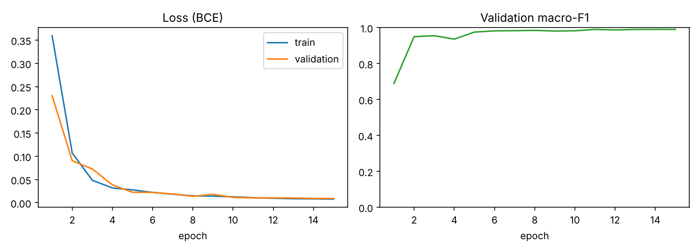
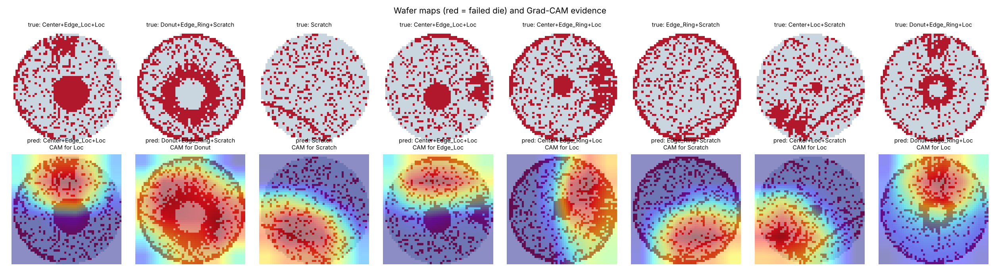

# Wafer Map Defect Classifier (MixedWM38)

Deep-learning classifier that recognizes **mixed-type defect patterns on semiconductor wafer maps**. One wafer can show several defects at once (for example Center + Scratch), so the model predicts 8 defect types independently (multi-label).

> 반도체 웨이퍼 맵의 복합 불량 패턴(Center, Donut, Edge-Ring, Scratch 등 8종, 38개 조합)을 CNN으로 분류하는 프로젝트입니다. 테스트 데이터 5,701장에서 Macro-F1 0.991, 완전 일치 정확도 98.5%를 달성했습니다. 불량 패턴은 공정 문제의 원인을 추적하는 단서가 되므로, 수율 분석 업무를 자동화하는 데 활용할 수 있습니다.

## Why this matters

After fabrication, every die on a wafer is tested electrically. The spatial pattern of failed dies points to the root cause: a ring at the edge suggests an edge-process problem, a line suggests a mechanical scratch, a cluster in the center suggests a deposition or etch issue. Yield engineers at memory fabs read these patterns every day. Automating the classification lets them find problems faster.

## Data

[MixedWM38](https://github.com/Junliangwangdhu/WaferMap) (Wang et al., *IEEE Transactions on Semiconductor Manufacturing*, 2020): 38,015 wafer maps of 52×52 dies collected from a real fab, with 1 normal pattern, 8 single defect types, and 29 mixed types.

| Value | Meaning |
| --- | --- |
| 0 | No die (outside the wafer) |
| 1 | Die passed the electrical test |
| 2 | Die failed the electrical test |

Labels: 8 binary flags, in order `Center, Donut, Edge_Loc, Edge_Ring, Loc, Near_Full, Scratch, Random`.

**Download:** get `Wafer_Map_Datasets.npz` from [Kaggle](https://www.kaggle.com/co1d7era/mixedtype-wafer-defect-datasets) or the [Google Drive link](https://drive.google.com/file/d/1M59pX-lPqL9APBIbp2AKQRTvngeUK8Va/view?usp=sharing) in the dataset repo, and put it in `data/`.

## Method

| Step | Choice | Why |
| --- | --- | --- |
| Input | 3 channels: no die / pass / fail | The model never confuses "outside the wafer" with "failed die" |
| Split | 70 / 15 / 15, stratified by all 38 pattern combinations | Every pattern appears in train, validation, and test |
| Augmentation | Random 90° rotations and flips | A defect keeps its type when the wafer is rotated |
| Model | 4-block CNN with BatchNorm and global average pooling (about 1.2M parameters) | Small enough to train on a laptop CPU or Apple GPU |
| Loss | Binary cross-entropy on 8 sigmoid outputs | Multi-label: several defects can be present at once |
| Explainability | Grad-CAM heatmaps | Checks the model looks at the failed dies that define each pattern |

## Results

Trained for 15 epochs on CPU (about 4 minutes per epoch). Test set: 5,701 wafer maps never seen during training.

| Metric (test set) | Score |
| --- | --- |
| Macro-F1 (8 defect types) | **0.991** |
| Exact-match accuracy (all 8 labels correct) | **98.5%** |

| Defect type | Precision | Recall | F1 | Test maps |
| --- | --- | --- | --- | --- |
| Center | 1.000 | 1.000 | 1.000 | 1,950 |
| Donut | 1.000 | 1.000 | 1.000 | 1,800 |
| Edge_Loc | 0.996 | 0.987 | 0.991 | 1,950 |
| Edge_Ring | 0.992 | 0.998 | 0.995 | 1,800 |
| Loc | 0.999 | 0.995 | 0.997 | 2,700 |
| Near_Full | 0.917 | 1.000 | 0.957 | 22 |
| Scratch | 0.998 | 0.990 | 0.994 | 2,850 |
| Random | 1.000 | 0.992 | 0.996 | 129 |

**What the results show**

- The hardest cases are wafers with 3–4 overlapping defects that include **Loc + Scratch** (lowest pattern: Edge_Loc+Loc+Scratch, 93.3% exact match). A local cluster and a scratch can overlap and look alike.
- **Near_Full** has the lowest precision because it has only 149 examples in the whole dataset (22 in test). More data or class weighting would be the next fix.
- Grad-CAM shows the model looks at the right dies: the scratch line for Scratch, the ring for Donut, the cluster for Loc.
- **Data quality note:** the dataset documents die values 0/1/2, but 214 cells in 105 maps contain 3. These are treated as failed dies (see `src/data.py`).

Per-class scores are in `results/per_class.csv`, and accuracy for each of the 38 patterns in `results/per_pattern.csv`.




## How to run

```bash
python -m venv .venv && source .venv/bin/activate
pip install -r requirements.txt

python src/train.py --synthetic --epochs 3     # 1-minute pipeline check, no dataset needed
python src/train.py --epochs 20                # full training on MixedWM38
python src/gradcam.py --n 8                    # save Grad-CAM examples
```

The scripts use an NVIDIA GPU or Apple Silicon GPU (MPS) automatically when available.

## Project structure

```
src/data.py      loading, 3-channel encoding, stratified split, augmentation
src/model.py     WaferNet CNN
src/train.py     training, evaluation, metrics and plots
src/gradcam.py   Grad-CAM visualizations
results/         metrics and figures (committed)
models/          trained weights (not committed)
```

## Next steps

- Compare against a ResNet-18 baseline and report the accuracy/size trade-off.
- Test on the real (unbalanced) WM-811K dataset to measure robustness.
- Serve the model as an API (portfolio project 5).
